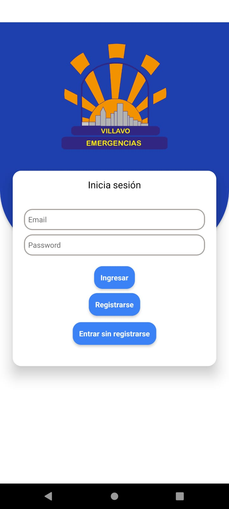
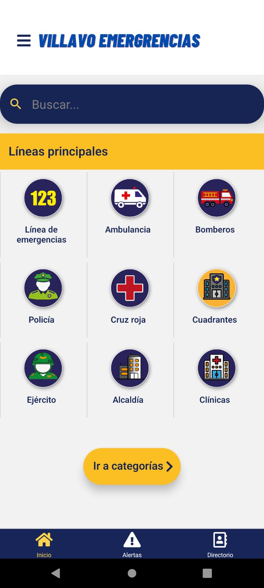
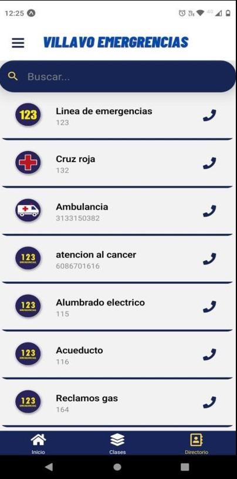
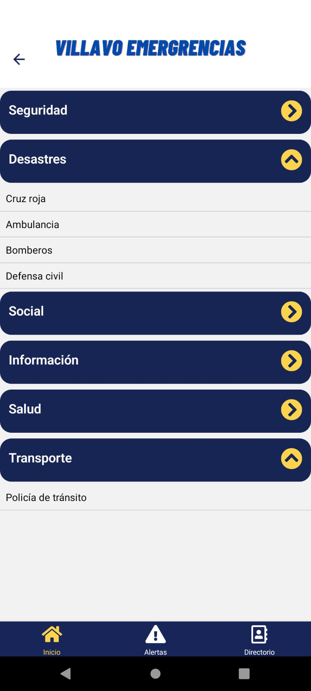
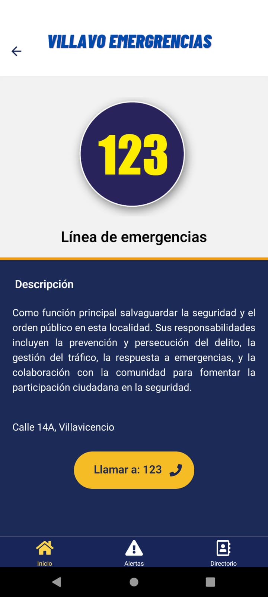
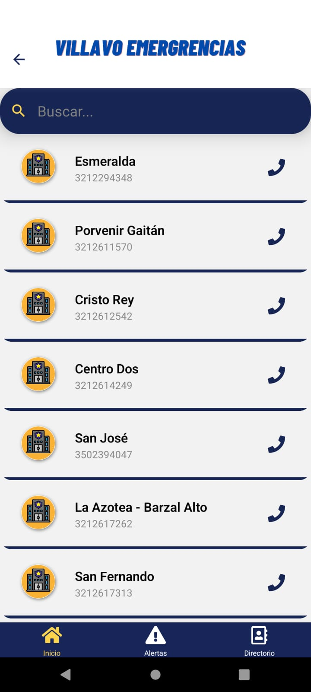
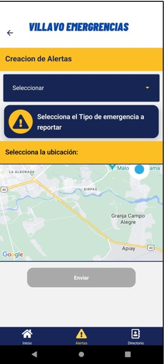
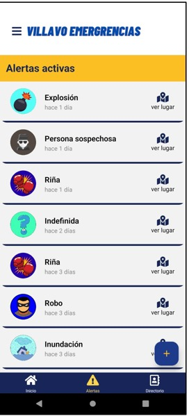
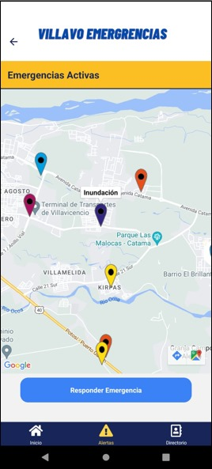
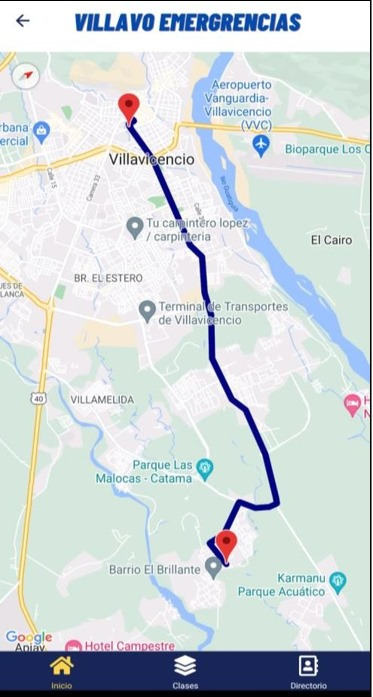

# app eEergencias - React Native 

Aplicación móvil desarrollada con React Native + Expo que permite a los ciudadanos reportar emergencias y verlas en un mapa en tiempo real. Los organismos de apoyo pueden responder a estas emergencias y seguir su ubicación.

---

## 📱 Funcionalidades

- Crear y registrar usuarios (ciudadanos y organismos).
- Reportar emergencias con ubicación, tipo y descripción.
- Visualizar alertas activas en el mapa.
- Ver ayuda en camino si una emergencia ha sido respondida.
- Sistema de autenticación con JWT.
- Soporte para distintos roles de usuario.

---

## ⚙️ Tecnologías

- Frontend: React Native + Expo
- Backend: Django + Django REST Framework
- Base de datos: PostgreSQL / SQLite
- Autenticación: JWT
- Mapa: react-native-maps + Google Maps API
- Almacenamiento: Firebase (para imágenes)
- Estado global: Redux Toolkit

---

## 📸 Capturas de pantalla

| Inicio de sesión | Menú de inicio |
|-----------------------|---------------------|
|   |  |

| Directorio de emergencias | Búsqueda por clasificación  |
|----------------------|------------------------|
|  |   |

| Detalles de la línea | Solicitud de cambio de rol  |
|----------------------|------------------------|
|  |   |

| Visualización de cuadrantes en la zona | Búsqueda de cuadrantes  |
|----------------------|------------------------|
|  |   |

| Creación de alertas de Emegencia | Visualización de alertas activas  |
|----------------------|------------------------|
|  |   |

| Mapa de alertas activas | Seguimiento de la emergencia  |
|----------------------|------------------------|
|   |  |

---

## 🚀 Instalación

1. Clona el repositorio

 ```bash
 git clone https://github.com/davidmarint/app-emergencia.git
 cd app-emergencia
 ```

2. Instala las dependencias:

 ```bash 
 npm install
 # o
 yarn install
 ```

3. Corre el proyecto:
```bash 
npx expo start
```
